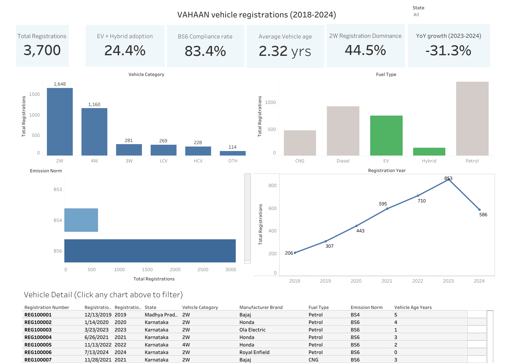

# VAHAN Vehicle Registration Dashboard

An interactive two-dashboard Tableau workbook analyzing vehicle registration trends across India, covering vehicle category, fuel type, emission norm compliance, and the EV/hybrid transition.

**[View the live dashboard on Tableau Public →](https://public.tableau.com/app/profile/mitansh.shroff/viz/shared/YS9C4589W)**



## Overview

Built on a synthesized VAHAN vehicle registration dataset spanning **12 states**, **~3,700 records**, and **2018–2024**, this project engineers eight calculated metrics beyond raw record counts: Total Registrations, Distinct States, Average Vehicle Age, EV+Hybrid Adoption Rate, BS6 Compliance Rate, 2-Wheeler Share, 2018–2024 CAGR, and 2023–24 Year-on-Year growth, so the dashboard speaks to volume, composition, pace of change, and the emissions/EV transition at a glance.

The workbook contains two dashboards:

- **VAHAAN Overview** — a strip of six KPI cards (Total Registrations, EV+Hybrid Adoption, YoY Growth, BS6 Compliance, 2W Share, Average Vehicle Age), followed by four charts (Registrations by Vehicle Category, Fuel Type, Emission Norm, and Year), and a record-level Vehicle Detail table. A state dropdown filters every view down to any one of the 12 states.
- **Key Metrics** — a standalone KPI scorecard.

All four main charts are wired into a single set of filter actions, so clicking any bar, segment, or line point cross-filters the other charts and the detail table letting a viewer move from national trends to specific vehicles in two clicks. An auto phone layout keeps the same interactions working on narrower screens.

## Design Decisions

- **Color:** Fuel Type maps EV and Hybrid to green against neutral grey for CNG/Diesel/Petrol, drawing the eye to the cleaner-fuel share through pre-attentive pop-out. Emission Norm uses a single-hue sequential blue scale (light BS3 → dark BS6) since the norms are ordinal. Vehicle Category deliberately stays a neutral, descending-sorted bar chart since those categories carry no inherent rank.
- **Layout:** Dashboards are ordered top to bottom by information density, Key Metrics first, the four categorical/trend charts second, row-level detail last following an overview-first, details-on-demand approach.
- **Consistency:** Descending sort on Vehicle Category, plus consistent spacing, alignment, and label placement across all four charts, applies the Gestalt principles of similarity and proximity so the panels read as one coherent story.

## Known Limitations & Next Steps

- CAGR and YoY KPI cards currently show a single value with no reference line or target band for context.
- The grey-and-green fuel-type palette hasn't been tested against a color-blindness simulator, red-green-sensitive viewers may not perceive the intended highlight as clearly.

A full write-up of the reasoning above is in `Summary and Reflection report.pdf`](./Summary and Reflection report.pdf).

## Dataset

`India_VAHAN_Dataset.csv` — 3,700 vehicle registration records across 12 Indian states (2018–2024).

| Column | Description |
|---|---|
| `Registration_Number` | Unique vehicle registration ID |
| `Registration_Date` / `Registration_Year` | Date and year of registration |
| `State` | Indian state of registration |
| `RTO_Office` | Regional Transport Office |
| `Vehicle_Category` | 2W, 3W, 4W, LCV, HCV, OTH |
| `Vehicle_Sub_Type` | e.g. Scooter, Motorcycle |
| `Manufacturer_Brand` | Vehicle manufacturer |
| `Fuel_Type` | Petrol, Diesel, CNG, EV, Hybrid |
| `Emission_Norm` | BS3, BS4, BS6 |
| `Engine_CC` | Engine displacement (cc) |
| `Seating_Capacity` | Number of seats |
| `Vehicle_Age_Years` | Age of the vehicle in years |

## Repository Structure

```
vahan-vehicle-registration-dashboard/
├── README.md
├── LICENSE
├── .gitignore
├── India_VAHAN_Dataset.csv
├── Summary_and_Reflection_report.pdf
└── assets/
    └── dashboard-overview.png  
```

## Author

Mitansh Shroff
